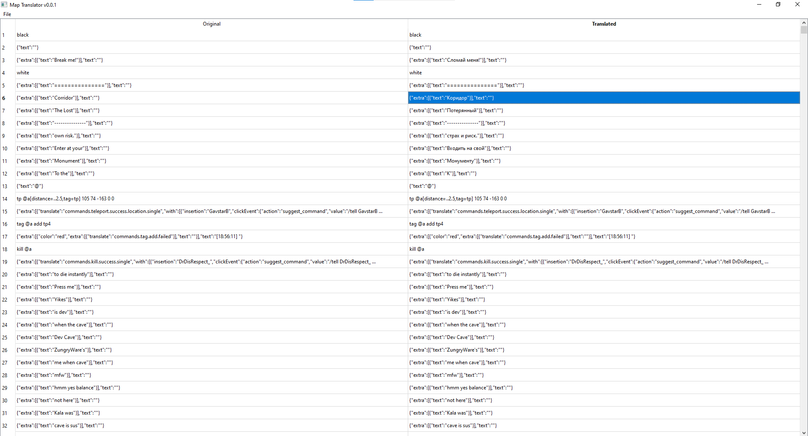

# Minecraft Map Translator v.0.0.1

Currently implemented features:
- Possibility to translate signs and command blocks in Overworld

## Quick-start
```
python3 -m pip install -r requirements.txt
python3 main.py
```

## Screenshots

